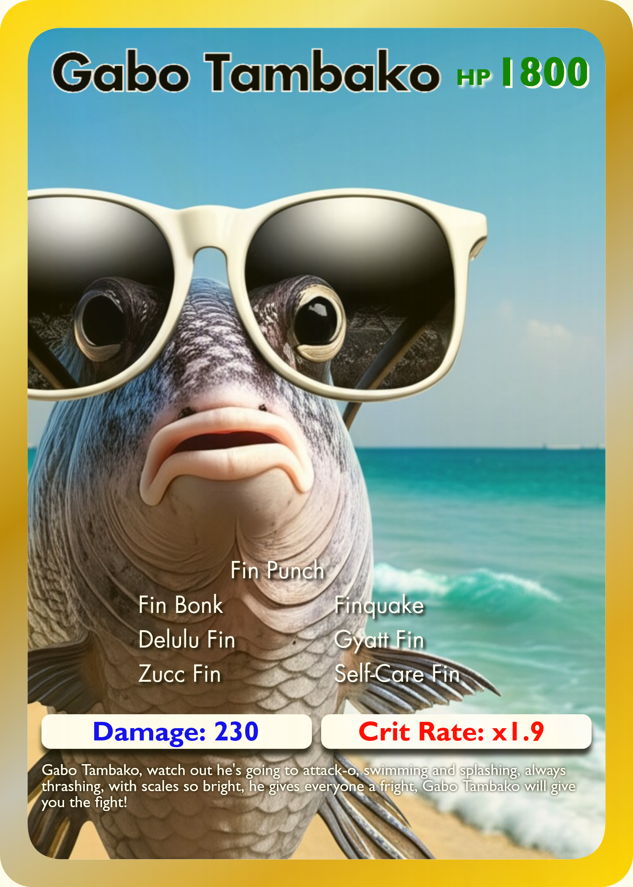
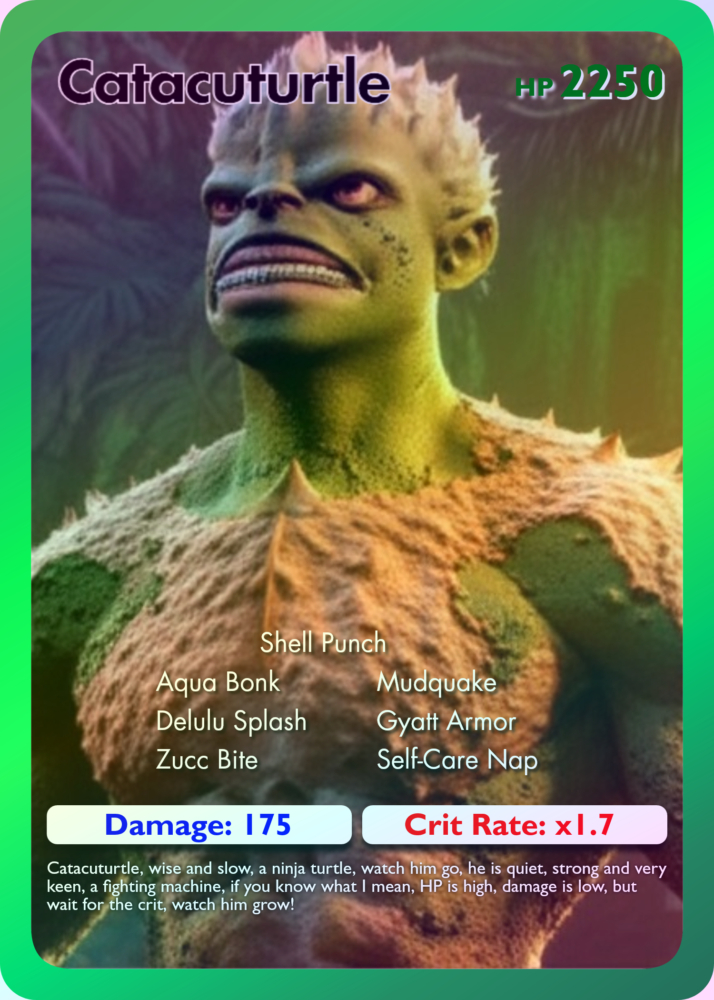
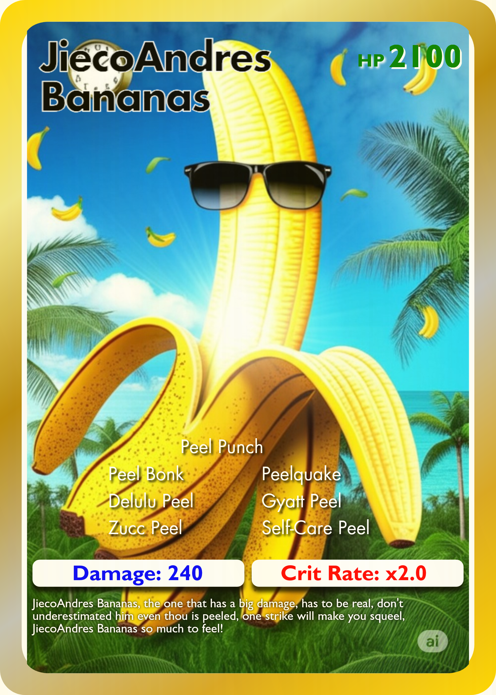

 

  

 

# Skibi-Thee Rival - AI-Powered Battle Card Game

## 💡 About the Project

**Skibi-Thee Rival** is an AI-powered web application where users can create, customize, and compete with digital battle cards generated from their own images and usernames. The platform is powered by the **Gemini API**, which analyzes user-provided images and text to generate creative card stats, descriptions, and visual prompts.

  
  
  

### **⚙ Tools and Technologies Used**

1. **Gemini API** - Core AI service for extracting features, generating card stats, and creating creative prompts from user images and text.
2. **React** - Frontend UI for uploading images, interacting with cards, and viewing leaderboards.
3. **Node.js & Express** - Backend server for API endpoints, image processing, and card data management.
4. **WebSockets** - Real-time notifications for new uploads and leaderboard updates.

## ❗❗ Disclaimer

This project was made as part of the final requirement for Application Development class at Pamantasan ng Lungsod ng Maynila. It is for learning purposes only and not meant for real-world or production use. This was a one-time submission and may not update or maintain this project regularly.

## 👥 Developers

<b>20242 BSCS 2-3

<b>LEADER: IWAG, John

-   CATACUTAN, Raphael
-   FRIAS, Railey
-   LAO, Jieco
-   LIBANG, Michael
-   MANGUNI, John
-   Oquendo, Zyryll
-   ROBANTE, Floyd